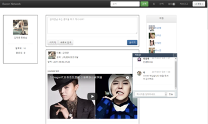

# Expertise-based social networking service
Web Application using jsp

## Development Environment
### Server
* Apache Tomcat
* JSP

### DataBase
* Oracle 11g

### Client
* HTML5
* CSS
* JavaScript
* jQuery
* Bootstrap

### API
* Saramin open api
* YouTube Data Api v3
* Facebook API

### External jar Library
* activation.jar
* commons-lang3-3.1.jar
* javax.mail-1.5.5.jar
* JBCrypt-0.4.1.jar
* JimiProClasses.jar
* ojdbc6_2.0.4.jar
* poi-3.17.beta1.jar
* poi-examples-3.17-beta1.jar
* poi-excelant-3.17-beta1.jar
* poi-ooxml-3.17.beta1.jar
* poi-ooxml-schemas-3.17-beta1.jar
* poi-scratchpad-3.17-beta1.jar
* tomcat-dbcp.jar

### Maven Repository
* google-api-services-youtube
* google-api-services-youtubeAnalytics
* google-api-services-youtubereporting
* google-api-services-youtube
* jackson-mapper-asl
* google-http-client-jackson2
* google-oauth-client-jetty
* google-collections
